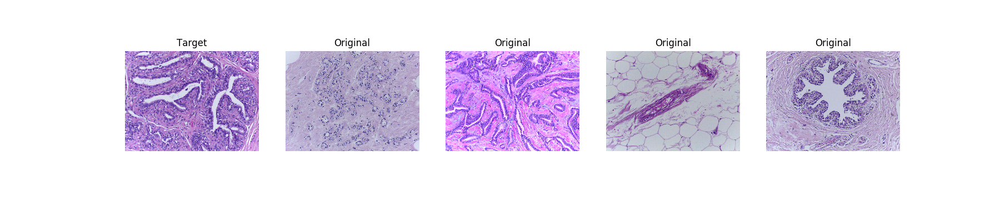
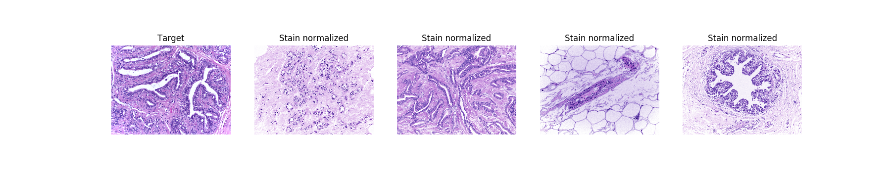
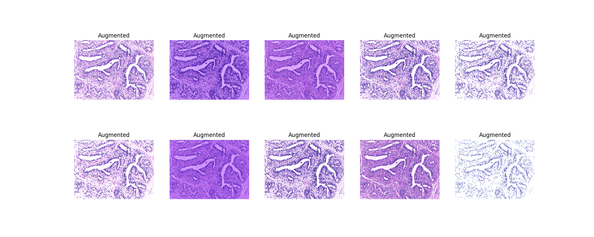

# StainTools

Tools for tissue image stain normalization and augmentation in Python 3.

## Install

1. `pip install staintools`
2. Install [SPAMS](http://spams-devel.gforge.inria.fr). This is a dependency to staintools and is technically available on PyPI (see [here](https://pypi.org/project/spams/)). However, personally I have had some issues with the PyPI install and would instead recommend using conda (see [here](https://anaconda.org/conda-forge/python-spams)).

## Quickstart

### Normalization

Original images: 



Stain normalized images:



```python
# Read data
target = staintools.read_image("./data/my_target_image.png")
to_transform = staintools.read_image("./data/my_image_to_transform.png")

# Standardize brightness (optional, can improve the tissue mask calculation)
target = staintools.LuminosityStandardizer.standardize(target)
to_transform = staintools.LuminosityStandardizer.standardize(to_transform)

# Stain normalize
normalizer = staintools.StainNormalizer(method='vahadane')
normalizer.fit(target)
transformed = normalizer.transform(to_transform)
```

### Augmentation



```python
# Read data
to_augment = staintools.read_image("./data/my_image_to_augment.png")

# Standardize brightness (optional, can improve the tissue mask calculation)
to_augment = staintools.LuminosityStandardizer.standardize(to_augment)

# Stain augment
augmentor = staintools.StainAugmentor(method='vahadane', sigma1=0.2, sigma2=0.2)
augmentor.fit(to_augment)
augmented_images = []
for _ in range(100):
    augmented_image = augmentor.pop()
    augmented_images.append(augmented_image)
``` 

## More examples

For more examples see files inside of the [`examples`](/examples) directory.